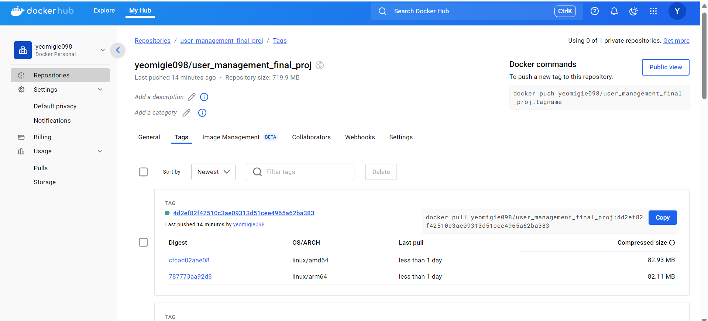

# User Management System

This repository contains the **User Management System** developed as part of the Software QA Analyst/Developer onboarding project for Prof. Keith Williams' class at NJIT.

## Project Overview

The User Management System provides a secure and reliable way to manage user accounts, including profile management, authentication, role-based access control, and email notifications.

## Features Implemented

* **User Registration and Authentication:** Secure registration, login, and JWT-based authentication.
* **User Profile Management:** Users can update their profile details, including a new "Display Name" feature.
* **Professional User Promotion:** Administrators can promote users to a professional status, triggering automated email notifications.
* **Role-Based Access Control:** Fine-grained permissions for various user roles (ADMIN, MANAGER, AUTHENTICATED, ANONYMOUS).
* **Automated Email Notifications:** Integrated email services for verification and professional status notifications.

## Technology Stack

* **Backend:** Python, FastAPI
* **Database:** PostgreSQL, SQLAlchemy, Alembic
* **Email Service:** SMTP with Mailtrap for testing
* **Storage:** MinIO (object storage for profile pictures)
* **Containerization:** Docker
* **CI/CD:** GitHub Actions, DockerHub

## Installation

### Prerequisites

* Docker and Docker Compose installed.
* GitHub CLI (optional for quick setup).

### Quick Setup

Clone repository:

```bash
git clone https://github.com/yeomigie/user_management_final_proj.git
cd user_management_final_proj
```

Start the application using Docker Compose:

```bash
docker-compose up --build
```

The application will run at: `http://localhost:8000`

## API Documentation

Interactive API documentation available via Swagger UI:

```
http://localhost:8000/docs
```

## Running Tests

To run automated tests locally:

```bash
docker-compose exec web pytest
```
## CI/CD and Deployment

* GitHub Actions workflow ensures automatic testing, Docker image building, and vulnerability scanning.
* Deployed Docker image on DockerHub: [yeomigie098/user_management_final_proj](https://hub.docker.com/repository/docker/yeomigie098/user_management_final_proj)


## Resolved Issues

* [#2 Profile Picture URL Validation](https://github.com/yeomigie/user_management_final_proj/issues/2)
* [#1 Missing Nickname Auto-Generation](https://github.com/yeomigie/user_management_final_proj/issues/1)
* [#3 Docker Build Failure](https://github.com/yeomigie/user_management_final_proj/issues/3)
* [#4 DockerHub Vulnerabilities](https://github.com/yeomigie/user_management_final_proj/issues/4)
* [#5 Email Verification Restrictions](https://github.com/yeomigie/user_management_final_proj/issues/5)

## Screenshots

| Screenshot                                         | Description                                                                               |
| -------------------------------------------------- | ----------------------------------------------------------------------------------------- |
|           | Interactive API docs demonstration. |
|  | Successful test run showing >90 % coverage across the user‑management endpoints.          |
|      | Green CI pipeline confirming migrations, tests, and Docker image push.                    |
|        | DockerHub repository page with the latest image tag and pull stats.                       |

---

## Project Structure

```
.
├── app
│   ├── models
│   ├── routers
│   ├── schemas
│   ├── services
│   └── utils
├── tests
│   ├── conftest.py
│   └── test_user_api.py
├── alembic (database migrations)
├── Dockerfile
├── docker-compose.yml
├── requirements.txt
└── README.md
```

## Future Enhancements

* Profile picture versioning
* Advanced role management
* Performance benchmarking